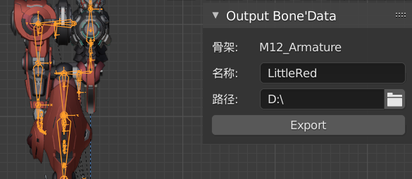

# OutputBoneData使用说明

#### 1. 安装插件

插件使用环境blender 2.92

打开 blender，点击 **Edit — Preferences — Add_ons — Install** ，选择blmaxbones插件的压缩包直接安装，勾选后运行 ；

> 中文 ： 编辑 — 偏好设置 — 插件 — 安装 

#### 2. 使用步骤

首先选择相应的骨架，输入导出数据的名称的路径后，按Export导出数据；

 